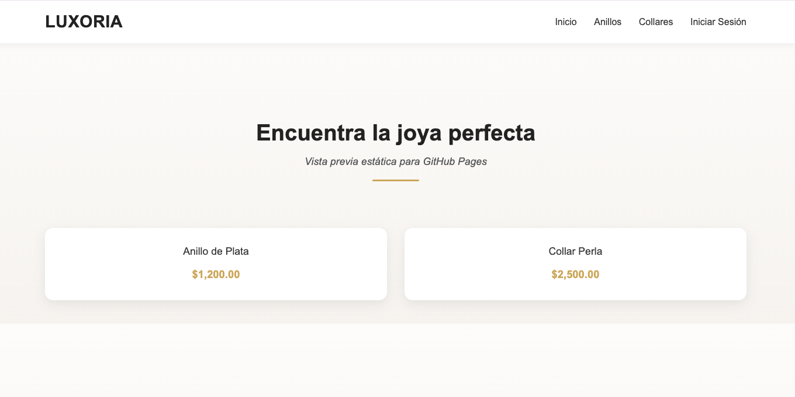
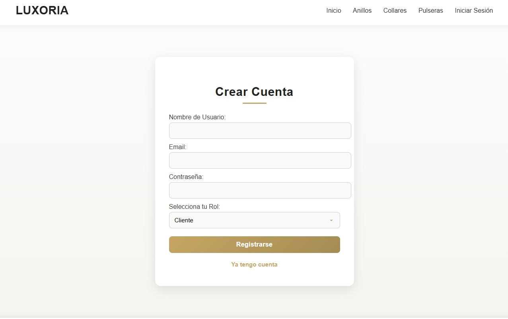
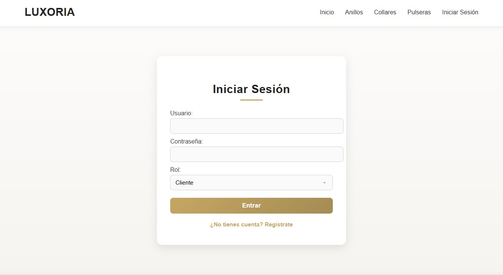

## Proyecto 20: Joyería Luxoria

Sistema de administración web para gestionar operaciones básicas de una joyería: clientes, inventario de productos y control de ventas.

### 🛠️ Tecnologías

- **Backend:** PHP
- **Base de Datos:** MySQL
- **Frontend:** HTML5, CSS3 (Custom Styles) y Bootstrap
- **Gestión:** Composer (Manejo de dependencias)

### 🚀 Características

**➕ Gestión de Registros**

- **Autenticación:** Registro e inicio de sesión seguro para usuarios.
- **Control de Acceso:** El ajuste de precios está restringido; solo los usuarios con perfil de **Cliente** pueden realizar modificaciones de costo.
- **Implementación de ORM:** Uso de Mapeo Objeto-Relacional para gestionar la lógica de negocio, permitiendo que los cambios en la base de datos se manejen como objetos PHP, mejorando la seguridad y mantenibilidad.

**🔍 Consultas e Informes**

- **Inventario Dinámico:** Visualización completa de joyas mediante tablas interactivas.
- **Sincronización:** Actualización de stock y precios en tiempo real.
- **Arquitectura Limpia:** Separación de responsabilidades con una carpeta `public_html` para el acceso web y `src` para la lógica interna.

### 📂 Estructura del Proyecto

```
├── index.html                # Interfaz estática para GitHub Pages
├── index.php                 # Acceso principal al sistema dinámico
├── style.css                 # Estilos visuales de la joyería
├── u821594572_joyeria_db.sql # Respaldo de la base de datos
└── src/                      # Carpeta de lógica y ORM
    ├── bootstrap.php         # Inicialización del ORM Doctrine
    ├── conexion.php          # Conexión segura a la base de datos
    └── Entities/             # Entidades para el mapeo de objetos (Producto.php)
```

### 🖼️ Previews

|      Módulo      |            Vista previa            |
| :--------------: | :--------------------------------: |
| Pagina Principal |  |
|     Registro     |        |
| Inicio de sesión |   |

### 🔗 Enlaces

- **Código Fuente:** [Repositorio en GitHub](https://github.com/danaemoremon/joyeria)
- **Demo en Vivo (Github Pages):** [Tienda de Joyería Web](https://danaemoremon.github.io/joyeria/)
- **Demo en Vivo (Hosting):** [Luxoria Shop Web](https://steelblue-meerkat-544740.hostingersite.com/)

```

```
